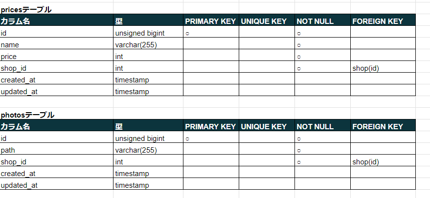

# rese

☆アプリの概要</br>
飲食店予約サービスのアプリです。ユーザはアプリ全体を管理する管理者、店舗のオーナーが管理する店舗代表者、予約サービスを利用できる一般ユーザに分かれています。
予約した際、QRの発行及び照合、予約した時点でのstripeを用いた決済も可能となっています。


☆作成した目的</br>
スクールの課題で制作しました。

☆アプリケーションのURL</br>

新規店舗管理者のパスワード、及び
既にシーダファイルの中に入っているユーザデータのパスワードはすべて"qwertyui"です。
メール送信はmailhogを使用しました。

☆機能一覧 </br>

全体の機能</br>

・マルチログイン機能（同一のログインページでログインユーザの権限を識別可）</br>

一般ユーザの機能</br>

・飲食店一覧ページの閲覧</br>
・飲食店来店者の口コミ閲覧</br>
・お気に入りの飲食店に対するいいね機能</br>
・料理のジャンル、立地、飲食店名での検索機能</br>
・飲食店予約機能</br>
・飲食店予約変更機能</br>
・飲食店キャンセル機能</br>
・いいねした店舗、予約済み店舗一覧の表示</br>
・予約に対するQRの発行</br>
・来店後の店舗に対する評価（口コミ）機能</br>
・投稿後の評価の編集</br>
・ログアウト機能</br>

店舗管理者の機能</br>

・管理している店舗一覧の表示</br>
・新規店舗作成</br>
・予約一覧の表示</br>
・QR読み込みアプリ</br>
・QRによる来店者の識別</br>
・予約者、（個人、日付け指定）へのメール送信機能</br>
・店舗情報の編集</br>
・予約前日のリマインダメールの一斉送信</br>

管理者の機能</br>

・新規店舗管理者の作成</br>
・店舗管理者が管理している店舗一覧の閲覧</br>
・一般ユーザ（一斉送信）、店舗管理者（個人）へのメール送信機能</br>

☆使用技術（実行環境）</br>
laravel 8.83.27</br>
php 7.4.9</br>
mysql</br>

☆テーブル設計</br>




☆ER図


☆環境構築</br>
Laravel,Dockerでの開発環境が整っていることが前提です。（開発バージョンは使用技術欄に記載）
1.プロジェクトを作成したいディレクトリまで移動する（１）</br>

2.git をcloneする（２）</br>

3.reseのディレクトリに移動(３)し、dockerのビルドをする（４）</br>

4.ログインページ(localhost:81/login)へ。
（シーディングしているメールは、一般ユーザか、店舗代表者か、管理者です。詳しくはその他の注意事項をご覧ください。）</br>

5.リマインダーメールを送信したい場合、phpコンテナ内に入り（５）、cronエントリを追加（６）する</br>

☆環境構築用コマンド一覧</br>
```php:rese
1.cd 各々のディレクトリ
2.git clone git@github.com:kinotake/rese.git
3.cd rese
4.docker-compose up --build
5.docker-compose exec php bash
6.* * * * * cd [プロジェクトのパス] && php artisan schedule:run >> /dev/null 2>&1
```

☆その他の注意事項</br>

・店舗管理者権限で予約一覧を見る際は、上から５つ（仙人、牛助、戦慄、ルーク、志摩屋）のデータを参照してください。データが入っています。</br>
シーディング済みデータ</br>
<table border="1">
    <tr>
        <th>権限</th> 
        <th>名前</th>
        <th>メールアドレス</th>
        <th>パスワード</th>
    </tr>
    <tr>
        <td>一般ユーザ</td>
        <td>中村光</td>
        <td>test@test</td>
        <td>qwertyui</td>
    </tr>
    <tr>
        <td>店舗管理者</td>
        <td>中山美穂</td>
        <td>owner@owner</td>
        <td>qwertyui</td>
    </tr>
    <tr>
        <td>管理者</td>
        <td>上杉謙信</td>
        <td>admin@admin</td>
        <td>qwertyui</td>
    </tr>
</table>

☆こだわったポイント</br>
1.来店前、来店後の顧客の管理</br>
予約しているユーザ一覧が、来店済み、来店前分けて表示されるため、店舗側の顧客管理が便利です。それらのデータは、予約用のQRコードを読み込むことで管理しています。</br>

2.一般ユーザでのマイページのレスポンシブ画面の表示</br>
レスポンシブ画面時、見出しの「いいね一覧」を押すことによって同じページのいいね一覧に一気に飛ぶことができます。予約が増えた際、スクロールの手間をなるべく減らすためにこのような仕様にしました。</br>
</br>
3.各権限でのヘッダの色</br>
権限によってヘッダ、及びロゴの色を変えています。店舗管理者権限の「管理店舗の一覧」及び「店舗情報の変更」は、一般ユーザと色味の見え方をなるべく似せ、編集時から変更後のイメージが付きやすいように、わざと色味が濃い目の青を使用しています。</br>


